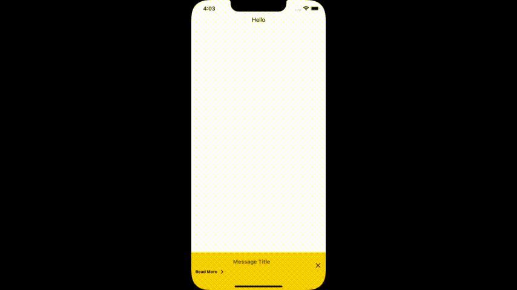

# Universal UILabel

UILabel that handles basic HTML tags <b>, <i>, <u>, <a>, etc. The links should have normal and active states. It must work in both frameworks: UIKit and SwiftUI in the same way.

📖 [article in Medium](https://medium.com/p/c00f9c1394c1)

